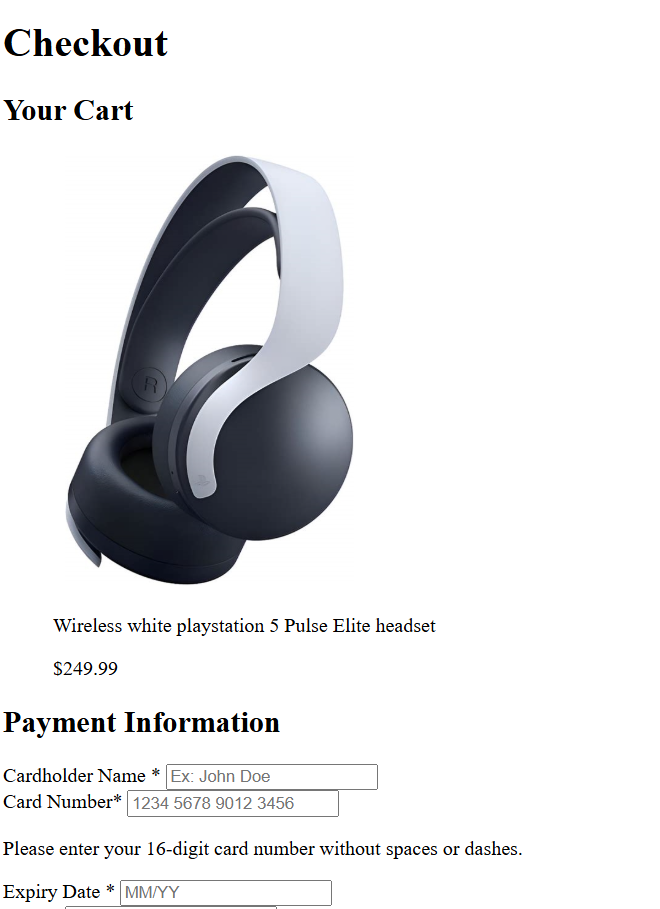

# Checkout-page

A checkout page built to practice semantic HTML and accessibility features (ARIA elements).

## Demo

https://irdxe.github.io/Checkout-page/

## About

This project was built to practice HTML fundamentals from freeCodeCamp, focusing in accessibility.

- Semantic HTML (including section, header, main, figure) 
- Form elements (including label, input, id, type, name, placeholder)
- Accessibility features (ARIA, figcaption)

## What I learned

- How to properly use semantic elements
- When to use ARIA elements
- How to use form elements

## How to run locally

1- Clone: git clone https://github.com/irdxe/Checkout-page.git
2- Open: Open `index.html` in your browser

## Screenshot

 

## Credits:

Based on freeCodeCamp exercises: https://www.freecodecamp.org/

